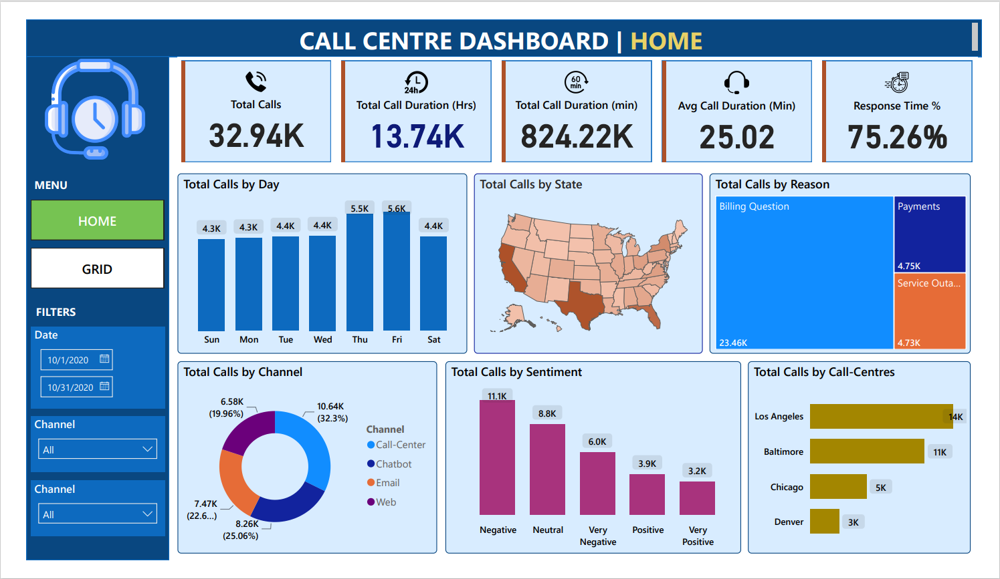
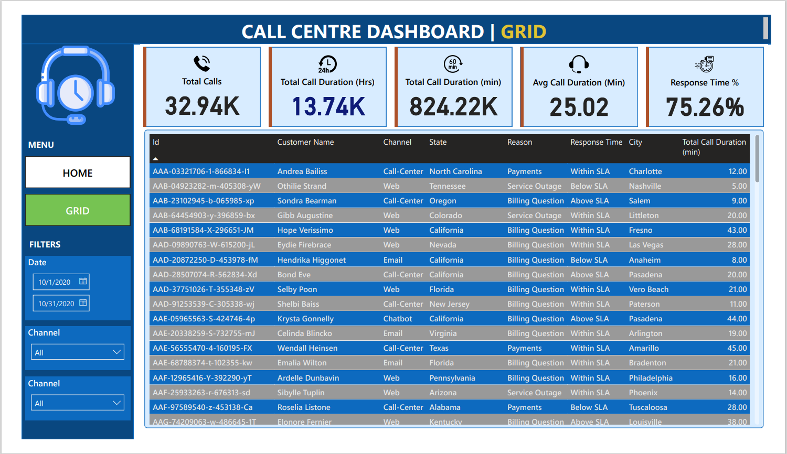

# Call Center KPI Dashboard

This repository contains a Power BI dashboard project designed to track and display key performance indicators (KPIs) for a call center. The dashboard helps in monitoring call center operations and performance, providing insights for better resource allocation, efficiency, and customer satisfaction.

## Project Overview

### Dashboard 1: Home

#### KPI Requirements
1. **Total Number of Calls**: Tracks the total number of calls received by the call center over a specified period.
2. **Total Call Duration in Hours**: Measures the total amount of time the call center staff spends on calls in hours.
3. **Total Call Duration in Minutes**: Similar to the total call duration in hours, but provides a more granular view in minutes.
4. **Average Call Duration in Minutes**: Calculates and displays the average call duration to assess the efficiency of the agents.
5. **Response Time Percentage**: Shows the percentage of calls answered within a predefined time frame to gauge prompt service.

#### Chart Requirements
1. **Total Call by Day (Column Chart)**: Displays the total number of calls on each day over a specified time period.
2. **Total Calls by State (Shape Map)**: Visualizes the total number of calls received from different states or regions.
3. **Top Reasons for Calls (Tree Map)**: Displays the top reasons for calls with each box representing a call reason.
4. **Total Calls by Channel (Donut Chart)**: Showcases the distribution of calls by different communication channels.
5. **Total Calls by Sentiment (Column Chart)**: Illustrates the distribution of calls by sentiment (e.g., positive, negative, neutral).
6. **Total Calls by Call Center (Bar Chart)**: Presents the total number of calls handled by each call center or department.



### Dashboard 2: Grid

- **Grid View Dashboard**: Displays a table of all call details in Power BI, allowing users to export the grid for various filters applied.



## Files in This Repository
- Dataset
  - `Call Center_Call Center.csv` 
- Screenshots of the dashboard
  - `Home.png`
  - `Grid.png`
- `call_centre_KPI_dashboard.pdf`
- `CALL CENTRE DASHBOARD.pbix`: The Power BI dashboard file.

## Getting Started

### Prerequisites
- Power BI Desktop

### Installation
1. Clone the repository:
   ```sh
   git clone https://github.com/harshala334/Call-Center-KPI-Dashboard.git
2. Open the **CALL CENTRE DASHBOARD.pbix** file in Power BI Desktop.
### Usage
1. Open the Power BI Desktop application.
2. Load the `CALL CENTRE DASHBOARD.pbix` file.
3. Explore the different KPIs and charts on the dashboard.
4. Use filters to customize the view as per your requirements.
5. Export data from the Grid View Dashboard if needed.
